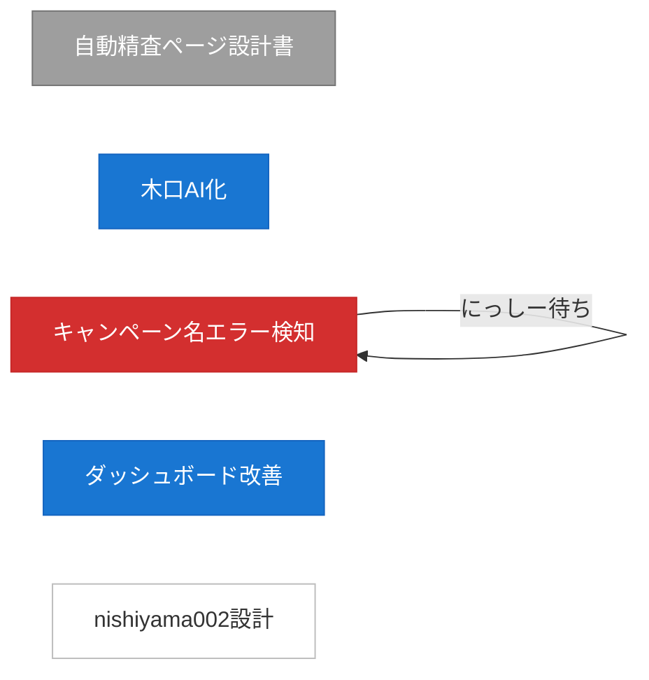

# 14. ダッシュボード Phase 3-2: タスクフロー可視化 — 3号実装指示書

**作成日:** 2026-03-05
**担当:** 西山3号
**レビュー:** 西山1号
**前提:** Phase 3-1（リアルタイムステータス）完了済み

---

## ゴール

全エージェントのタスク依存関係をフローチャートで可視化する。
「誰が誰をブロックしてるか」が一目でわかるようにする。

## 技術選定

- **Mermaid.js**（CDN経由）
- D3.jsは過剰。Mermaidで十分
- 既存Express + EJS基盤に追加

## 要件

### 1. データ取得

- 既存の `/api/tasks` エンドポイントからタスク一覧を取得
- 各タスクの `id`, `title`, `status`, `blockedBy` を使用
- `blockedBy` がある場合、依存関係の矢印を描画

### 2. Mermaid フローチャート生成

- レイアウト: `LR`（左→右）
- ノードの色分け:
  - `done` → グレー（`:::done`）
  - `in_progress` → 青（`:::inprogress`）
  - `todo` → 白（`:::todo`）
  - `blocked` → 赤（`:::blocked`）
- `blockedBy` 関係 → 赤い矢印（`-->|blocked|`）
- 通常の依存 → 通常の矢印

### 3. UI配置

- ダッシュボードの「タスク一覧」セクションの上に配置
- セクションタイトル: 「📊 タスクフロー」
- 折りたたみ可能（デフォルト展開）
- レスポンシブ対応（横スクロール許容）

### 4. インタラクション

- ノードクリック → 右サイドパネルにタスク詳細表示
  - タスク名、ステータス、説明、output（あれば）
  - パネルは既存のカードスタイルに合わせる
- ホバーでタスク名のフルテキスト表示（長い場合ノード上では省略）

### 5. 動的更新

- SSE経由でタスク更新を受け取ったら、Mermaidを再レンダリング
- `mermaid.init()` の再呼び出しで対応可能

## Mermaid記法サンプル

## 実装ステップ

1. Mermaid.js CDNをEJSテンプレートに追加
2. `/api/tasks` レスポンスから Mermaid記法を動的生成するJS関数作成
3. ダッシュボードにフローチャートセクション追加
4. クリックイベント → 詳細パネル実装
5. SSE更新時の再レンダリング接続
6. スタイル調整・テスト

## 工数見積

4-5時間

## 完了条件

- [ ] フローチャートがダッシュボードに表示される
- [ ] ステータスによる色分けが正しい
- [ ] blockedBy関係が赤矢印で表示される
- [ ] ノードクリックで詳細パネル表示
- [ ] SSE更新で自動再レンダリング
- [ ] commit & push
